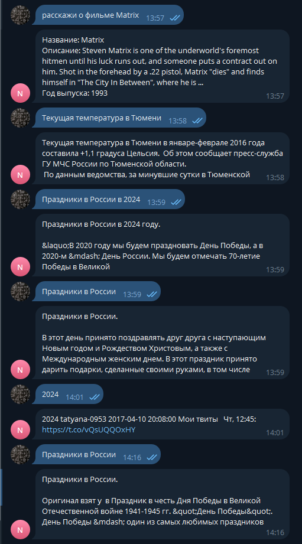

```markdown
# Курсовой проект: Чат-бот для Telegram

## Описание

Данный курсовой проект посвящен созданию чат-бота для Telegram, который использует дообученные NLP-модели и реализует 5 сценариев:

1. Разговорный бот.
2. Предоставление информации о текущей погоде в российских городах.
3. Предоставление информации о праздничных днях в России.
4. Предоставление информации о фильмах.
5. Предоставление данных о товарах из предоставленной базы товаров.

## Используемые технологии и модели

- NLP-модель: ruGPT-3 от Сбербанка, дообученная на диалогах из датасета "Toloka Persona Chat Rus".
- Погодный сервис: API OpenWeatherMap.
- Информация о праздниках: API Calendarific.
- Информация о фильмах: API OMDB (The Open Movie Database).
- Обработка текстов: библиотека Transformers от Hugging Face.
- Эмбеддинги текстов: модель paraphrase-multilingual-mpnet-base-v2 от sentence-transformers.
- База вопросов и ответов: датасет RuBQ 2.0 от Toloka.

## Структура проекта

- `COURSE_WORK.ipynb`: Ноутбук с кодом бота, обработкой данных и обучением моделей.
- `ProductsDataset.csv`: База данных продуктов.
- `images/`: Папка с изображениями, используемыми в файле README.md.

<ins>Общий пайплайн работы бота:</ins>  
1) Приветственное сообщение начало диалога.  

2) Проверка запроса о покупках. При обнаржении запроса о покупках или товарах, предлогается ознакомится с каталогом товаров.
   Далее есть возможность показать карту выбранного товара. Если не нашлись ключевые слова или сущность  
   то сообщение передаётся дальше по пайплайну.   
3) Проверка на запрос о погоде. Если не нашлись ключевые слова или сущность локации,  
   то сообщение передаётся дальше по пайплайну. 
4) Проверка на запрос о праздниках . Если не нашлись ключевые слова или сущность локации,  
   то сообщение передаётся дальше по пайплайну. 
5) Проверка на запрос по названию фильма.При обнаржении запроса о фильме или названии фильма
   происходит обращение к OMDB для получении информации о фильме.
7) Разговорный бот. Сообщения, которые прошли все вышеперечисленные фильтры  
считаются сообщениями беседы и передаются модели GPT для генерации ответа.  
  
## Запуск

Для запуска бота необходимо установить все зависимости и запустить скрипт `COURSE_WORK.ipynb`. 

## Тестирование

Бот доступен для тестирования в Telegram по адресу [@CW_HW16_bot](https://t.me/CW_HW16_bot).

## Авторы

PromDex

## Лицензия

Этот проект лицензирован в соответствии с условиями лицензии [MIT](LICENSE).
```
